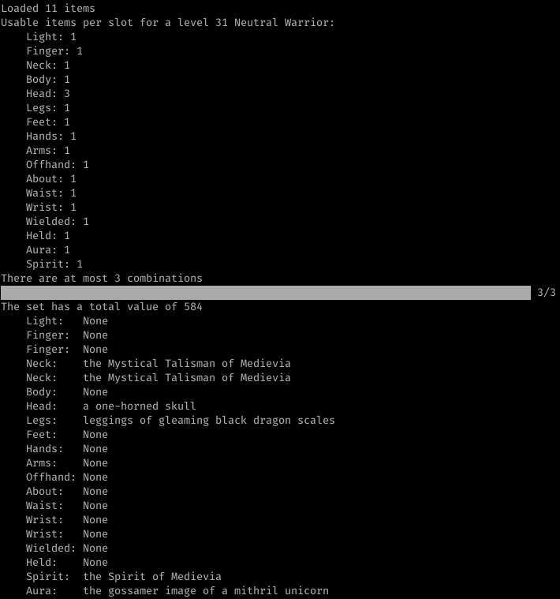

# Equipment Optimizer

An example RPG equipment combination optimizer, targetted at Medievia but it should be simple to adapt to other games.

## To Do

* [ ] Weight all attributes
  * [ ] Allow customisation of weights
  * [ ] Allow lower and upper limits on attributes
* [ ] Benchmarks
* [ ] Tests
* [ ] Parallel evaluation, perhaps by making multi_cartesian_product chunkable for better use of rayon

## Screenshot

